# Challenge: AWS Three-Tier Architecture, CloudFormation, Lambda, CodeBuild and CI/CD 
## AWS Three-Tier Architecture 💥 [Infrastructure provisioning]

A 3-Tier architecture provides a general framework for deploying traditional client/server applications into three logical tiers; the Web, Application, and Database tier. End users interact with the Web tier which provides them with a user interface they can use to view, modify, or submit information. The Application tier is responsible for handling the requests made by the user. The Application or Middle tier is the brains behind the operation. It assists in translating users actions into business logic that allow for data processing by programs. Lastly, the Database or Data tier is where the information processed by the application is stored and managed.

### Design

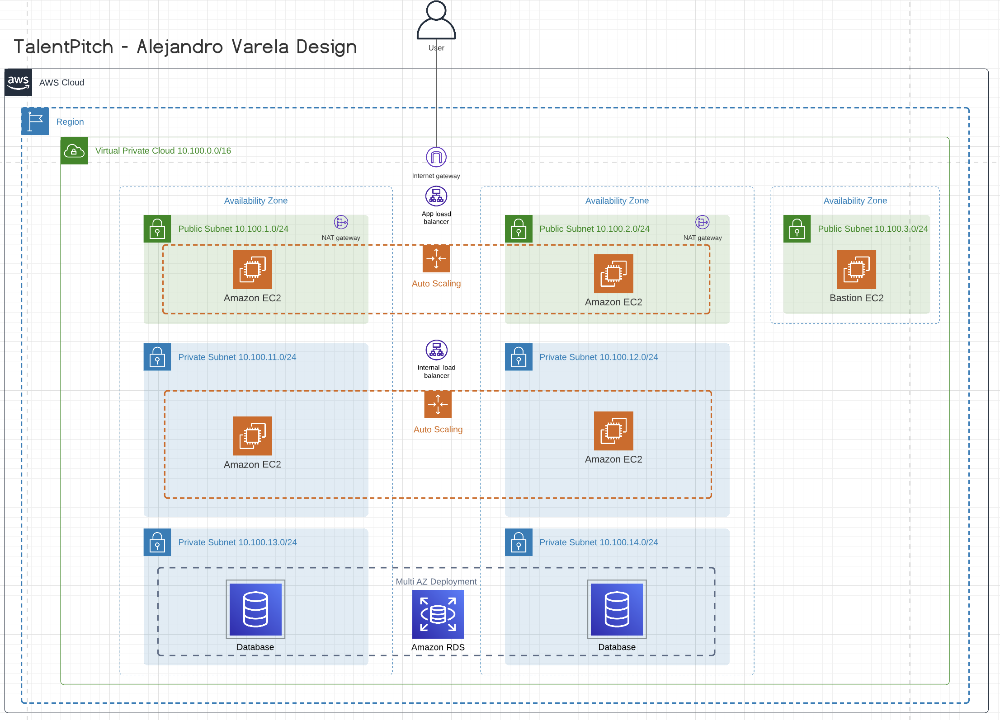

In case you wonder why we will use availability zones?

1. High Availability
2. Disaster Recovery
3. Data Sovereignty
4. Scalability
5. Fault Tolerance

#### Web Tier [Frontend]

In this layer, we will create a public load balancer and an auto-scaling group. The load balancer will be used to distribute traffic across the instances.

**Resources:**

- 2 public subnets
- Public route table
- Internet Gateway & NAT Gateway
- Internet facing Application Load Balancer with a Security Group allowing inbound permission from the Internet.
- Minimum of 2 EC2 instances in an Auto Scaling Group.
- EC2 Security Group allowing inbound permission from the the Web Tier Application Load Balancer
- Create a public route table and associate the 2 public subnets.

#### Application Tier [Backend]

In this layer, we will create an internal load balancer and an auto-scaling group. The load balancer will be used to distribute traffic across the application servers. The auto-scaling group will be used to scale the number of application servers up or down based on the demand.

**Resources:**

- 2 private subnets
- Private route table
- Internal Application Load Balancer with a Security Group allowing inbound permission from EC2 instances in the Web Tier.
- Minimum of 2 EC2 instances in an Auto Scaling Group
- EC2 Security Group allowing inbound permission from the Application Tier Application Load Balancer
- Image host on docker hub 
- Associate with private route table

#### Database Tier [Data]

In this layer, we will create a Multi AZ RDS MySQL database. The database will be used to store the data for the application.

**Resources:**

- 2 private subnets
- Public route table
- MySql RDS Database with Multi AZ standby instance
- The Database Security Group allowing inbound traffic for MySQL from the Application Server Security Group

#### Admin Tier [Ops]

In this layer, we will create a bastion host. The bastion host will be used to access compute services in private networks for administration purposes.

**Resources:**

- 2 private subnets
- Public route table
- MySql RDS Database with Multi AZ standby instance
- The Database Security Group allowing inbound traffic for MySQL from the Application Server Security Group

## Let's do it 🚀

### Prerequisites

- AWS Account
- AWS CLI, for installation in linux operative system follow the next steps:

    ```sh
    curl "https://awscli.amazonaws.com/awscli-exe-linux-x86_64.zip" -o "awscliv2.zip"
    unzip awscliv2.zip
    sudo ./aws/install
    ```

- Configuring AWS CLI you need **access key and secret key**, you can create it in IAM service.

    ```sh
    aws configure
    ```

1. Creat an EC2 Key Pair used to SSH into the bastion host

```bash
aws ec2 create-key-pair --key-name aws-tree-tier-app-varela --query 'KeyMaterial' --output text > aws-tree-tier-app-varela.pem
```

2. Infrastructure as Code with CloudFormation

- Parameters: Are a way to provide input values to a CloudFormation stack at the time of stack creation or update. Parameters allow you to customize the behavior and configuration of your stack templates without modifying the template itself.

    1. KeyPair: The name of an existing EC2 KeyPair to enable SSH access to the instances
    2. DatabaseUser
    3. DatabasePassword

- Mappings: Are a way to provide conditional parameters to your CloudFormation template based on region or environment. Mappings are a great way to keep your CloudFormation templates DRY.

- Conditions: Are a way to control whether certain resources are created or whether certain resource properties are assigned a value during stack creation or update. Conditions are declared in the Conditions section of a CloudFormation template.

- Resources: Are the core of your CloudFormation template. Resources are the AWS components that you want to deploy as part of your infrastructure such as EC2 instances, RDS databases, VPCs, and more. In our we will create the following resources.

    1. VPC
    2. Internet Gateway
    3. NAT Gateway
    4. Public Subnets [3]
    5. Private Subnets [4]
    6. Public Route Table
    7. Private Route Table
    8. Web Tier Security Group
    9. Application Tier Security Group
    10. Database Tier Security Group
    11. Bastion Host Security Group
    12. Web Tier Application Load Balancer
    13. Application Tier Application Load Balancer
    14. Web Tier Auto Scaling Group
    15. Application Tier Auto Scaling Group
    16. Database Tier RDS MySQL

- Outputs: Are a way to return information about your AWS infrastructure stack after it has been created or updated. Outputs are declared in the Outputs section of a CloudFormation template.

- Transform: Is a macro that processes your template in two phases. In the first phase, the macro processes all intrinsic functions except for Fn::Transform. In the second phase, the macro recursively expands macros. The following example shows a template that uses the AWS::Include transform to include a snippet of YAML-formatted template code from an Amazon S3 bucket.

- Metadata: Is a section in a CloudFormation template that contains additional information for AWS CloudFormation to process but that is not strictly part of the template's AWS resources. Metadata is optional.

3. Create a CloudFormation Stack

```bash
aws cloudformation create-stack --stack-name aws-tree-tier-app-varela --template-body file://./iac/main.yml --parameters file://./iac/parameters.json
```

4. Check the status of the stack

```bash
aws cloudformation describe-stacks --stack-name aws-tree-tier-app-varela --query 'Stacks[0].StackStatus'
```

5. Check the outputs of the stack

    - Bastion Host Public IP
    - Web Tier Application Load Balancer URL
    - Application Tier Application Load Balancer URL
    - Endpoint URL address for our RDS MySQL Database
    - RDS MySQL Database TCP Port used

    ```bash
    aws cloudformation describe-stacks --stack-name aws-tree-tier-app-varela --query 'Stacks[0].Outputs'
    ``` 

6. Delete the stack

```bash
aws cloudformation delete-stack --stack-name aws-tree-tier-app-varela
```

Remarks in the process of the infrastructure as code creation we have the following error:

- Resource handler returned message: "Cannot find version 8.0.30 for mysql

This error is because the version of the mysql database is not available in the region where the stack is being created, to solve this problem we must see the engine versions available in the region where we are going to create the stack.

```bash
aws rds describe-db-engine-versions --engine mysql --query "*[].{Engine:Engine,EngineVersion:EngineVersion}" --output text
```

# Configuration Management

Before we SSH into our Bastion Host let’s use SCP to copy our key pair file and config script to the Bastion Host. We can obtain the public IP address of the Bastion Host from the Outputs section of our stack deployment from earlier.

```bash
scp -i ./iac/aws-tree-tier-app-varela.pem -o StrictHostKeyChecking=no ./iac/aws-tree-tier-app-varela.pem ec2-user@<Bastion Host Public IP>:/home/ec2-user
scp -i ./iac/aws-tree-tier-app-varela.pem -o StrictHostKeyChecking=no ./configuration/config.sh ec2-user@<Bastion Host Public IP>:/home/ec2-user
```

Before execute the following command we need to change database host and server host in the config.sh file.

Now let’s SSH into our Bastion Host.

```bash
ssh -i ./iac/aws-tree-tier-app-varela.pem -o StrictHostKeyChecking=no ec2-user@<Bastion Host Public IP> 
chmod 777 config.sh 
chmod 400 aws-tree-tier-app-varela.pem 
./config.sh
```

Check the status of the web tier server.

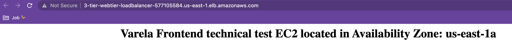

Check the status of the application tier server.

```bash
ssh -i ./iac/aws-tree-tier-app-varela.pem -o StrictHostKeyChecking=no ec2-user@<Bastion Host Public IP>
ssh -i aws-tree-tier-app-varela.pem -o StrictHostKeyChecking=no ec2-user@<Web Tier Private IP>
curl internal-alb
```

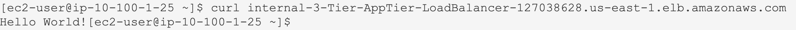

From app tier server we can check the status of the database server.

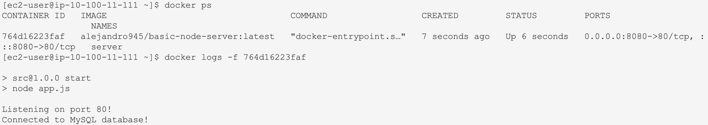

```bash
 mysql --host=demo-database.cbmn4afmh1uc.us-east-1.rds.amazonaws.com --user=admin --password=admin123
 CREATE DATABASE test;
 \q
```

# Lambda AWS

## What is Lambda?

Is a serverless computing service provided by AWS, it runs your code in response to events and automatically manages the underlying compute resources for you. You can use AWS Lambda to extend other AWS services with custom logic, or create your own back-end services that operate at AWS scale, performance, and security.

**Requirements:**

- Create an IAM role for the AWS Lambda function and assign the necessary permissions to perform the task.

    IAM Role creation:

    ```bash
    aws iam create-role --role-name LambdaRole --assume-role-policy-document file://./serverless/trust-policy.json
    {
        "Role": {
            "Path": "/",
            "RoleName": "LambdaRole",
            "RoleId": "AROASMH5QOAHG56GJEXL4",
            "Arn": "arn:aws:iam::163740413966:role/LambdaRole",
            "CreateDate": "2023-05-28T03:27:27+00:00",
            "AssumeRolePolicyDocument": {
                "Version": "2012-10-17",
                "Statement": [
                    {
                        "Effect": "Allow",
                        "Principal": {
                            "Service": "lambda.amazonaws.com"
                        },
                        "Action": "sts:AssumeRole"
                    }
                ]
            }
        }
    }
    ```

    Attach Policy to Role:

    ```bash
    aws iam attach-role-policy --role-name LambdaRole --policy-arn arn:aws:iam::aws:policy/AmazonS3FullAccess
    ```

    Create source-bucket and upload a local image file

    ```bash
    aws s3api create-bucket --bucket source-bucket-444 --region us-east-1
    aws s3 cp ./assets/design.png s3://source-bucket-444/src/design.png
    ```

- Use the AWS CLI to create an AWS Lambda function that performs a simple task, such as copying a file from one Amazon S3 bucket to another bucket.

    ```bash
    aws lambda create-function --function-name MyLambdaFunction \
    --zip-file fileb://./serverless/basic.zip --handler s3-basic-operations.lambda_handler --runtime python3.8 \
    --role arn:aws:iam::163740413966:role/LambdaRole
    ```

    Invoke the AWS Lambda function to verify that it works correctly.

    ```bash
    aws lambda invoke --function-name MyLambdaFunction out --log-type Tail \
    --query 'LogResult' --output text |  base64 -d
    ```

    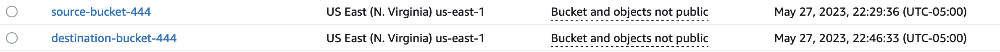

    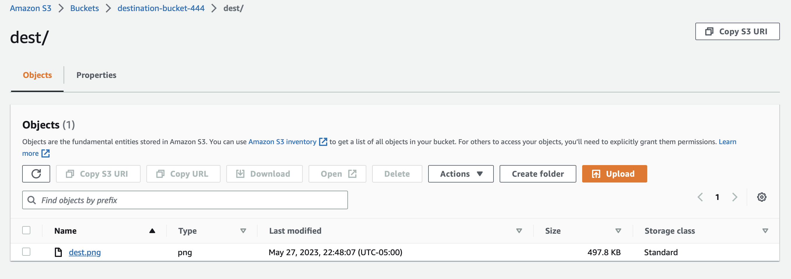

    Clean up the AWS Lambda function and the IAM role.

    ```bash
    aws lambda delete-function --function-name MyLambdaFunction
    aws iam detach-role-policy --role-name LambdaRole --policy-arn arn:aws:iam::aws:policy/AmazonS3FullAccess
    aws iam delete-role --role-name LambdaRole
    aws s3 rm s3://source-bucket-444/src --recursive
    aws s3api delete-bucket --bucket source-bucket-444
    aws s3 rm s3://destination-bucket-444/dest --recursive
    aws s3api delete-bucket --bucket destination-bucket-444
    ```

# CodeBuild AWS

**Requirements:**

Use CodeBuild to build the CloudFormation deployment artifact from the CloudFormation template.

A stack template file defines the resources that AWS CloudFormation provisions and configures. These files are the same template files that you use when you create or update stacks using AWS CloudFormation.

1. Upload the CloudFormation template to the S3 bucket and the buildspec.yml

    ```bash
    aws s3 cp ./iac/main.yml s3://source-bucket-444/src/main.yml
    aws s3 cp ./build/buildspec.yml s3://source-bucket-444/src/buildspec.yml
    ```
2. Create IAM role for CodeBuild

    ```bash
    aws iam create-role --role-name CodeBuildRole --assume-role-policy-document file://./build/trust-policy.json
    aws iam attach-role-policy --role-name CodeBuildRole --policy-arn arn:aws:iam::aws:policy/AdministratorAccess
    ```
3. Create CodeBuild project

    ```bash
    aws codebuild create-project --cli-input-json file://./build/codebuild-project.json
    ```

4. Run the build
    
    ```bash
    aws codebuild start-build --project-name codebuild-demo-varela
    aws codebuild batch-get-builds --ids codebuild-demo-varela:4dba753c-d699-4b15-9e5b-b033a82fe83c
    ```

5. Check the result

    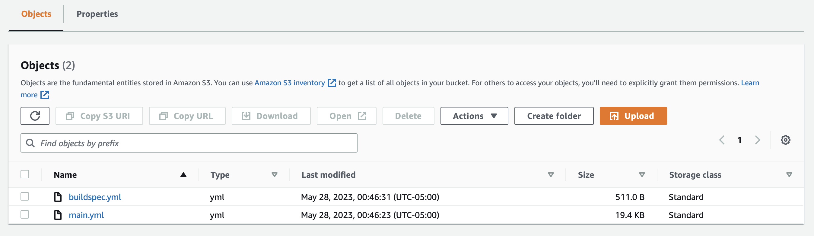

    ```bash
    {
            "id": "codebuild-demo-varela:4dba753c-d699-4b15-9e5b-b033a82fe83c",
            "arn": "arn:aws:codebuild:us-east-1:163740413966:build/codebuild-demo-varela:4dba753c-d699-4b15-9e5b-b033a82fe83c",
            "buildNumber": 1,
            "startTime": "2023-05-28T05:53:16.050000+00:00",
            "currentPhase": "PROVISIONING",
            "buildStatus": "IN_PROGRESS",
            "projectName": "codebuild-demo-varela",
            "phases": [
                {
                    "phaseType": "SUBMITTED",
                    "phaseStatus": "SUCCEEDED",
                    "startTime": "2023-05-28T05:53:16.050000+00:00",
                    "endTime": "2023-05-28T05:53:16.137000+00:00",
                    "durationInSeconds": 0
                },
                {
                    "phaseType": "QUEUED",
                    "phaseStatus": "SUCCEEDED",
                    "startTime": "2023-05-28T05:53:16.137000+00:00",
                    "endTime": "2023-05-28T05:53:19.501000+00:00",
                    "durationInSeconds": 3
                }
    }
    ```

6. Clean up

    ```bash
    aws codebuild delete-project --name codebuild-demo-varela
    aws iam detach-role-policy --role-name CodeBuildRole --policy-arn arn:aws:iam::aws:policy/AdministratorAccess
    aws iam delete-role --role-name CodeBuildRole
    aws s3 rm s3://source-bucket-444/src --recursive
    aws s3api delete-bucket --bucket source-bucket-444
    ```

# CI/CD AWS

**Requirements:**
Create a gtihub workflow with two jobs, one to set up the environment and simulate running automated unit tests, and another that only runs if tests pass to deploy to an EC2 instance, over SSH using a file deploy.sh

Copy deploy.sh to the bastion host

```bash
scp -i ./iac/aws-tree-tier-app-varela.pem -o StrictHostKeyChecking=no ./deploy.sh ec2-user@<Bastion Host Public IP>:/home/ec2-user
chmod 777 deploy.sh
```

Secrets on github

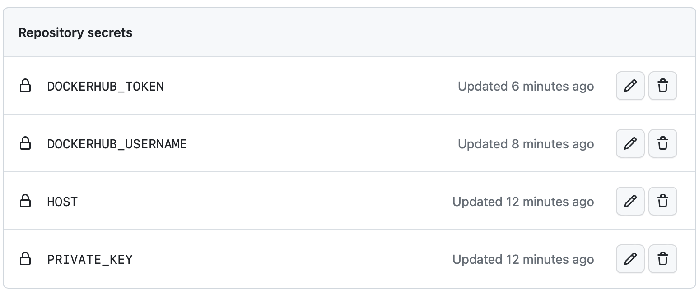

Proof of pipeline

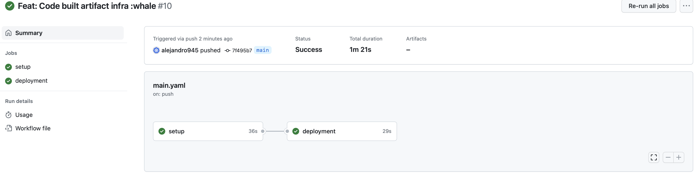

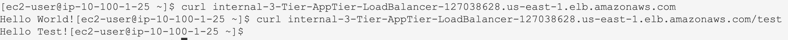

# Monitoring AWS

**Requirements:**
Add a CloudWatch alert that sends an email notification when the RDS database exceeds 80% capacity

1. Create a IAM policy for allow CloudWatch to send email notifications

```bash
aws iam create-policy --policy-name CloudWatchEmailNotification --policy-document file://./monitoring/cloudwatch-email-notification-policy.json
{
    "Policy":
        "PolicyName": "CloudWatchEmailNotification",
        "PolicyId": "ANPASMH5QOAHDUC57XQ4O",
        "Arn": "arn:aws:iam::163740413966:policy/CloudWatchEmailNotification",
        "Path": "/",
        "DefaultVersionId": "v1",
        "AttachmentCount": 0,
        "PermissionsBoundaryUsageCount": 0,
        "IsAttachable": true,
        "CreateDate": "2023-05-28T04:41:20+00:00",
}
```

2. Get ARN of the policy

```bash
aws iam list-policies --query 'Policies[?PolicyName==`CloudWatchEmailNotification`].Arn' --output text
# arn:aws:iam::163740413966:policy/CloudWatchEmailNotification
```

3. Create a SNS topic

```bash
aws sns create-topic --name RDS-Storage-Usage
```

4. Configure CloudWatch to send email notifications

```bash
aws cloudwatch put-metric-alarm --alarm-name RDS-Storage-Usage --alarm-description "RDS Storage Usage" --metric-name CPUUtilization --namespace AWS/RDS --statistic Average --period 300 --threshold 80 --comparison-operator GreaterThanThreshold --dimensions Name=DBInstanceIdentifier,Value=demo-database --evaluation-periods 1 --alarm-actions arn:aws:sns:us-east-1:163740413966:RDS-Storage-Usage --unit Bytes
```

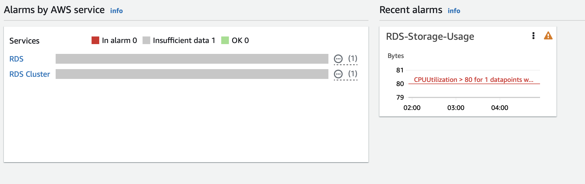

5. Delete resources

```bash
aws cloudwatch delete-alarms --alarm-names RDS-Storage-Usage
aws sns delete-topic --topic-arn arn:aws:sns:us-east-1:163740413966:RDS-Storage-Usage
aws iam delete-policy --policy-arn arn:aws:iam::163740413966:policy/CloudWatchEmailNotification
``` 


